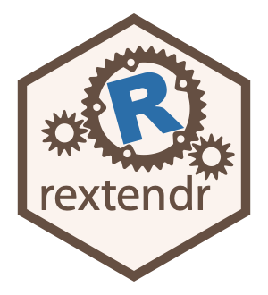

<!-- README.md is generated from README.Rmd. Please edit that file -->

# Call Rust code from R 

<!-- badges: start -->

[](https://github.com/extendr/rextendr/actions)
[](https://CRAN.R-project.org/package=rextendr)
[](https://www.tidyverse.org/lifecycle/#experimental)
<!-- badges: end -->

## Installation

To install the package, run:

    remotes::install_github("extendr/rextendr")

Note that this will install the package but does not guarantee that the
package can do anything useful. You will also need to set up a working
Rust toolchain, including libclang/llvm-config support to run
[bindgen](https://rust-lang.github.io/rust-bindgen/). See the
[installation instructions for
libR-sys](https://github.com/extendr/libR-sys) for help. If you can
successfully build libR-sys you’re good.

## Usage

Basic use example:

    library(rextendr)

    # create a Rust function
    rust_function("fn add(a:f64, b:f64) -> f64 { a + b }")

    # call it from R
    add(2.5, 4.7)
    #> [1] 7.2

The package also enables a new chunk type for knitr, `extendr`, which
compiles and evaluates Rust code. For example, a code chunk such as this
one:

    ```{extendr}
    rprintln!("Hello from Rust!");

    let x = 5;
    let y = 7;
    let z = x*y;

    z
    ```

would create the following output in the knitted document:

    rprintln!("Hello from Rust!");

    let x = 5;
    let y = 7;
    let z = x*y;

    z
    #> Hello from Rust!
    #> [1] 35
